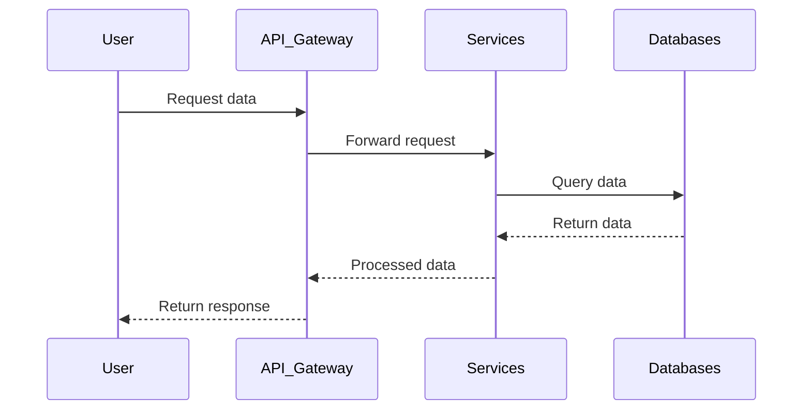

# Architecture Overview

This document outlines the response flow of the application architecture.

### Components Descriptions:

- **User**: The end-user making requests to the system.
- **API Gateway**: The central point that receives requests from users and forwards them to relevant services.
- **Services**: Business logic layer that processes requests and communicates with databases.
- **Databases**: Data storage systems that provide data to services upon request.