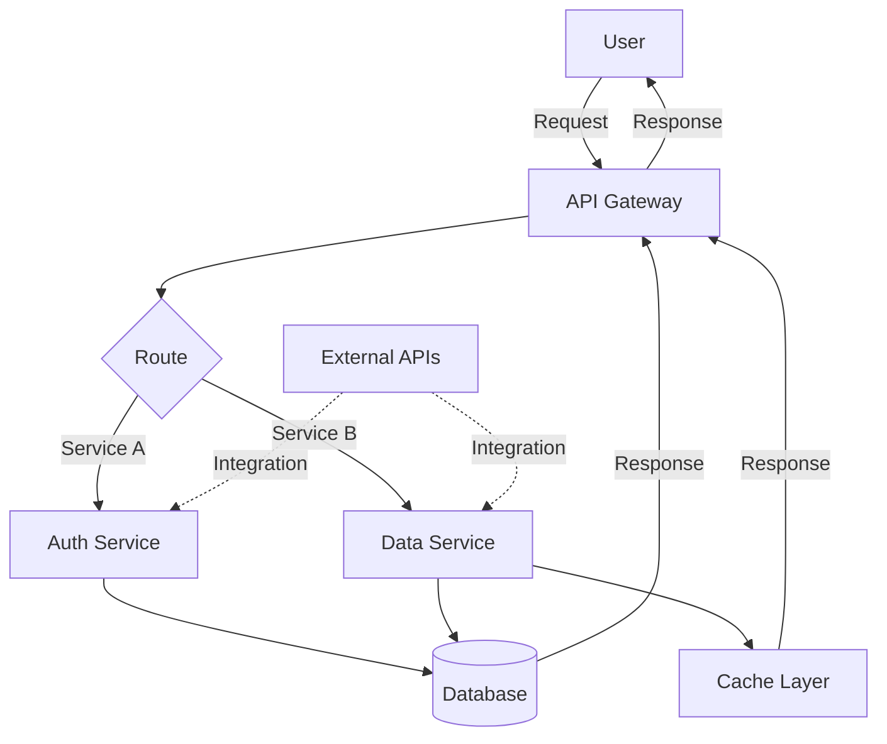

# Architecture Overview

## Components

### API Gateway
Entry point for all client requests. Routes requests to appropriate services and handles load balancing.

### Auth Service
Manages user authentication and authorization. Validates tokens and permissions for secure access.

### Data Service
Handles business logic and data operations. Manages interactions with the database and cache.

### Database
Persistent storage for application data. Stores user information, application state, and historical data.

### Cache Layer
In-memory caching system for frequently accessed data. Improves performance and reduces database load.

### External APIs
Third-party integrations and external service connections.

## Data Flow

1. Users send requests to the API Gateway
2. Gateway routes requests based on the service requirement
3. Services process requests and interact with the database/cache as needed
4. Responses are aggregated and returned through the gateway
5. Results are sent back to the user