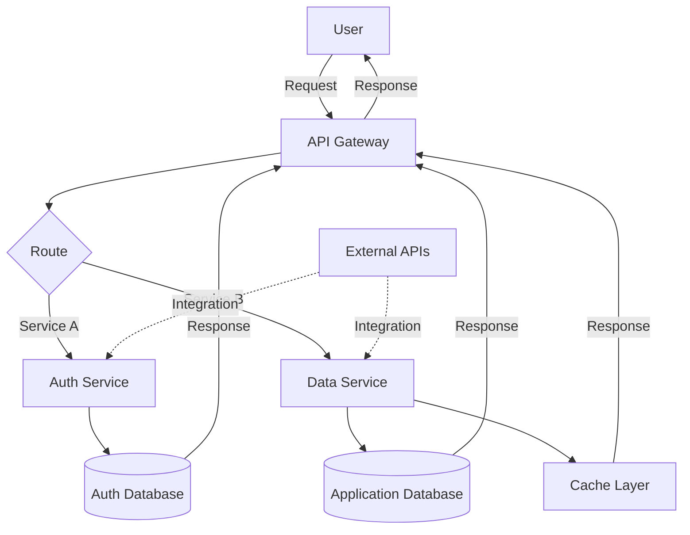

# Architecture Overview

## Components

### API Gateway
Entry point for all client requests. Routes requests to appropriate services and handles load balancing.

### Auth Service
Manages user authentication and authorization. Validates tokens and permissions for secure access. Connects exclusively to the Auth Database for credential verification.

### Data Service
Handles business logic and data operations. Manages interactions with the Application Database and cache layer.

### Auth Database
Dedicated database for authentication and user credentials. Stores hashed passwords, tokens, and user identity information.

### Application Database
Persistent storage for application-specific data. Stores user information, application state, and historical data.

### Cache Layer
In-memory caching system for frequently accessed data. Improves performance and reduces database load.

### External APIs
Third-party integrations and external service connections.

## Data Flow

1. Users send requests to the API Gateway
2. Gateway routes requests based on the service requirement
3. Auth Service validates credentials against the Auth Database
4. Data Service processes requests and interacts with the Application Database/cache
5. Services return responses to the gateway
6. Results are aggregated and sent back to the user